# Модуль интерпретации: устройство и механизмы

Документ описывает `inc/Interpreter.hpp` и `src/Interpreter.cpp` — рантайм-часть языка (`VM`, `Environment`, `Value`). Все диаграммы построены по фактическому коду и отражают текущее (актуальное) поведение.

---

## 1. Место интерпретатора в конвейере

`VM` — последняя из четырёх фаз `main.cpp`. Она получает от парсера то же самое плоское AST (`nodes` + `child_indices`), что и видел `Analyzer`, но не имеет доступа к результатам типового анализа (`node_resolved_types`) — заново выводит всё нужное из токенов узлов по ходу выполнения.

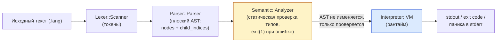

Ключевой инвариант архитектуры: **`Analyzer` и `VM` — два независимых обхода одного и того же дерева.** `VM` не читает кэш типов анализатора и не подозревает о существовании `Analyzer` — он просто доверяет, что если исполнение до него дошло, то программа статически корректна (типы согласованы, точка входа существует, арность встроенных функций верна и т.д.). Единственная связь между фазами — порядок вызова в `main.cpp`: `semantic.analyze(root)` завершает процесс через `exit(1)` при ошибке, не давая `vm.run(root)` вообще начаться.

---

## 2. Основные структуры данных

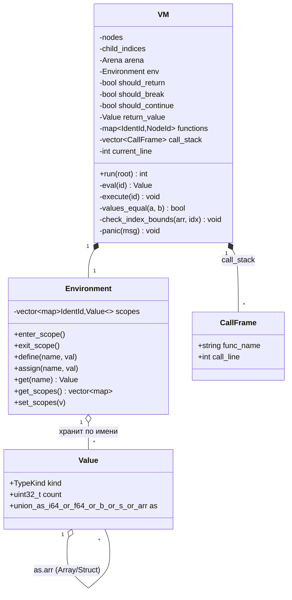

### 2.1 `Value` — универсальное рантайм-значение

`Value` — это тегированное объединение (`kind` + `union as`) плюс поле `count`, добавленное поверх union'а:

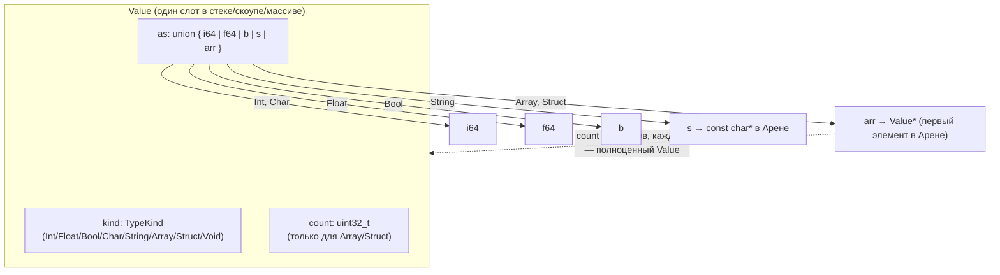

Важно: `Value` **не хранит свой статический `TypeId`** — только грубую категорию `kind`. Это осознанное упрощение: интерпретатору не нужен полный `TypeTable`, потому что статический анализ уже гарантировал корректность типов везде, где это важно. Но для массивов/структур одного `kind == Array` недостаточно, чтобы узнать размер — отсюда поле `count`: оно заполняется один раз при создании значения (`ArrayLiteral`/`StructLiteral`) и дальше просто копируется вместе с `as.arr` при каждом присваивании/передаче параметра, как единое "толстое значение" (указатель + длина). Именно `count` делает возможными проверку границ индекса (§7) и глубокое сравнение `==`/`!=` (§8) без обращения к типам вообще.

### 2.2 `Environment` — стек областей видимости

Это просто `std::vector<std::unordered_map<IdentId, Value>>`. Поиск переменной (`get`/`assign`) идёт от **последнего** элемента вектора (самая внутренняя область) к первому (самая внешняя = глобальная):

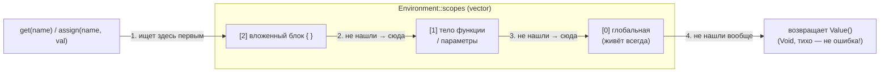

`Environment::get` **никогда не бросает ошибку** на ненайденное имя — она просто не может произойти при штатной работе, так как `Analyzer` гарантировал, что все используемые идентификаторы объявлены. Отсутствие проверки здесь — не дефект, а сознательное доверие к статическому анализу (см. §1).

---

## 3. Два диспетчера: `eval` vs `execute`

У `VM` два взаимно рекурсивных метода, а не один универсальный `visit`. Это отражает разницу между **выражениями** (у них есть значение — `eval` возвращает `Value`) и **инструкциями** (у них есть эффект, но не значение — `execute` возвращает `void` и вместо этого выставляет флаги `should_return`/`should_break`/`should_continue`).

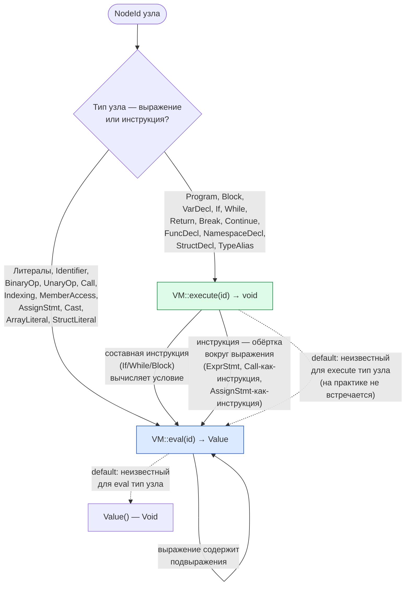

Взаимная рекурсия видна в самом коде: `execute(If)` вызывает `eval(условие)`, а `eval(Call)` вызывает `execute(тело_функции)`. Это ожидаемо — язык позволяет вызывать функции внутри выражений, а функции состоят из инструкций.

### 3.1 Обход дерева и три "прерывающих" флага

`execute` не использует `return`/`break`/`continue` C++ для передачи управления вверх по стеку вызовов интерпретатора — вместо этого три булевых поля `VM` (`should_return`, `should_break`, `should_continue`) устанавливаются в точке инструкции и **проверяются на каждом уровне обхода**, пока не будут погашены тем узлом, которому они предназначены.

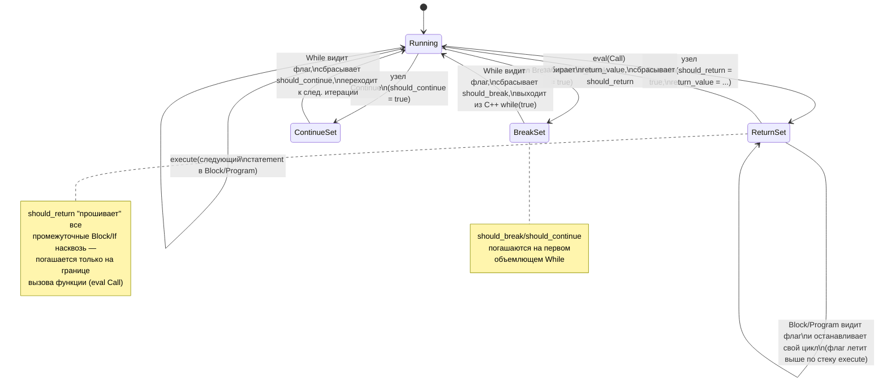

Каждый вызов `execute(id)` начинается проверкой `if (should_return || should_break || should_continue) return;` — это и есть механизм "протекания" сигнала вверх без исключений и без явного возвращаемого значения у `execute`. `Block`/`Program` в цикле по своим детям после каждого `execute(child)` проверяют эти же три флага и обрывают собственный цикл, если сработал любой из них — именно так `вернуть`/`прервать`/`продолжить`, написанные глубоко внутри вложенных `{ }`, долетают до нужного уровня.

---

## 4. Жизненный цикл `VM::run`

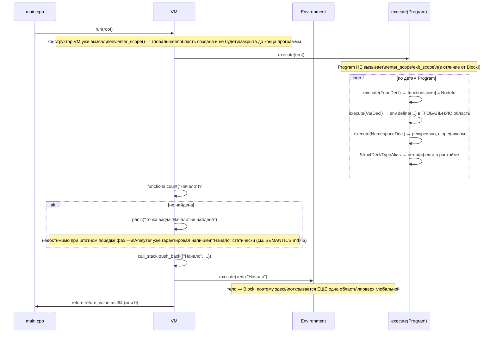

После этого прохода `functions` — плоская таблица `IdentId → NodeId` (полное имя функции, включая префикс пространства имён, → узел её `FuncDecl`), а глобальная область `Environment` содержит все верхнеуровневые переменные. Это тот самый механизм, который делает глобальные переменные видимыми из любой функции (подробности — §5).

---

## 5. Область видимости во времени: почему глобальные переменные работают

Ниже — снимки стека `env.scopes` в разные моменты выполнения программы вида:

```text
целое счётчик = 100;             // глобальная переменная
функция помощник(): целое { вернуть счётчик + 1; }
функция Начало(): целое {
    целое x = 1;
    { целое y = 2; }
    помощник();
    вернуть 0;
}
```

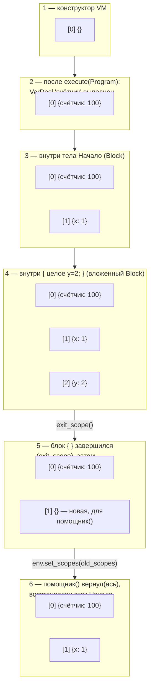

Момент **4 → 5** — самый нетривиальный: вызов `помощник()` (узел `Call` в `eval`) не расширяет текущий стек, а **полностью заменяет** его на `[копия scopes[0], новая пустая область]` — таким образом тело `помощник` не видит `x`/`y` вызывающего кода (нет замыканий), но видит глобальную область (индекс 0). После возврата исходный стек `[0]=счётчик, [1]=x` восстанавливается — но не буквально тем же объектом, а с одним нюансом, показанным в следующей диаграмме.

### 5.1 Почему запись в глобальную переменную внутри вызова не теряется

`Environment::get_scopes()`/`set_scopes()` работают **по значению** (копируют весь `vector`). Значит, вызываемая функция получает *копию* глобальной области, а не ссылку на неё — если её тело изменит глобальную переменную, изменится только копия. Чтобы это изменение всё же было видно после `return`, `eval(Call)` явно переносит копию обратно перед восстановлением остального стека вызывающего кода:

```mermaid
sequenceDiagram
    participant Caller as Вызывающий код
    participant EvalCall as eval(Call) для "помощник()"
    participant Env as Environment.scopes

    Caller->>EvalCall: eval(узел Call)
    EvalCall->>Env: old_scopes = get_scopes()
    Note over Env: old_scopes = [{счётчик:100}, {x:1}]
    EvalCall->>EvalCall: new_scopes = [old_scopes[0], {}]
    EvalCall->>Env: set_scopes(new_scopes)
    Note over Env: живой стек теперь\n[{счётчик:100}, {}] — копия!
    EvalCall->>EvalCall: bind параметры в new_scopes[1]
    EvalCall->>EvalCall: execute(тело помощник)
    Note over Env: если тело сделало\n"счётчик = счётчик + 1;",\nизменяется ТОЛЬКО живая копия
    EvalCall->>Env: get_scopes()[0]  (текущее, изменённое)
    EvalCall->>EvalCall: old_scopes[0] = это значение
    EvalCall->>Env: set_scopes(old_scopes)
    Note over Env: живой стек снова\n[{счётчик:101}, {x:1}] —\nизменение перенесено!
    EvalCall->>Caller: return ret_val
```

Без этого переноса (`old_scopes[0] = env.get_scopes()[0]` перед финальным `set_scopes`) любое присваивание глобальной переменной внутри функции, вызванной не напрямую из тела `Начало`, откатывалось бы сразу после `return`. Перенос происходит на **каждом** возврате из вызова, поэтому эффект накапливается корректно и через произвольную глубину вложенных вызовов (A зовёт B зовёт C; изменение C всплывает в B при возврате из C, затем в A при возврате из B).

---

## 6. Механизм вызова функции: полная схема

`eval(Call)` — самый длинный обработчик в `VM`. Он ветвится на два совершенно разных пути: встроенные функции (обрабатываются инлайн, без стека вызовов) и пользовательские функции (полный механизм с подменой областей видимости).

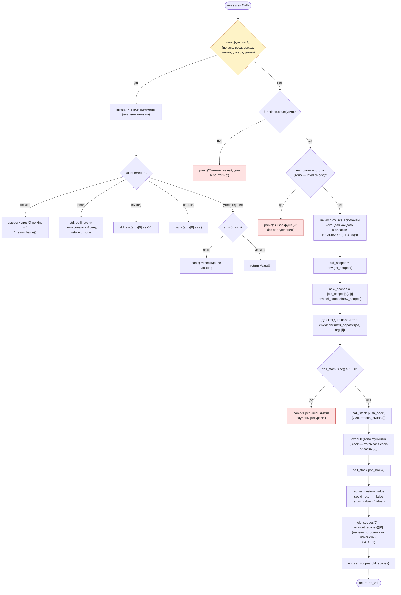

Заметные детали, которые легко упустить при чтении кода линейно:

* **Аргументы вычисляются до подмены области видимости** (`EVALARGS` до `SAVESCOPE`) — поэтому выражения-аргументы видят переменные *вызывающего* кода, как и положено, а не пустой контекст вызываемой функции.
* Параметры функции всегда объявляются в `new_scopes[1]` — второй (после глобальной) области, поэтому тело функции их видит, но не видит `new_scopes[1]` вызывающего кода (замыканий нет, см. §5).
* Если тело функции — `Block`, оно откроет **третью** область (`env.enter_scope()` внутри `execute(Block)`) поверх параметров — это обычный вложенный блок, работает как везде.
* Проверка глубины рекурсии (`call_stack.size() > 1000`) происходит **после** подмены области видимости, но **до** фактического исполнения тела — то есть регресс по стеку вызовов регистрируется прежде, чем может произойти переполнение стека самого C++ (`eval`/`execute` рекурсивны на уровне хоста).

---

## 7. Массивы и структуры: единое представление, границы, вложенность

Массивы и структуры в рантайме — это **одно и то же представление**: `Value` с `kind ∈ {Array, Struct}`, указателем `as.arr` на блок в Арене и `count`. Разница между массивом и структурой существует только на уровне статических типов (`Semantic::Type`), не в рантайме — интерпретатор не различает их при индексации/сравнении, только `MemberAccess` (для структур) использует заранее вычисленный `offset`, а `Indexing` (для массивов) — вычисляемый в рантайме индекс.

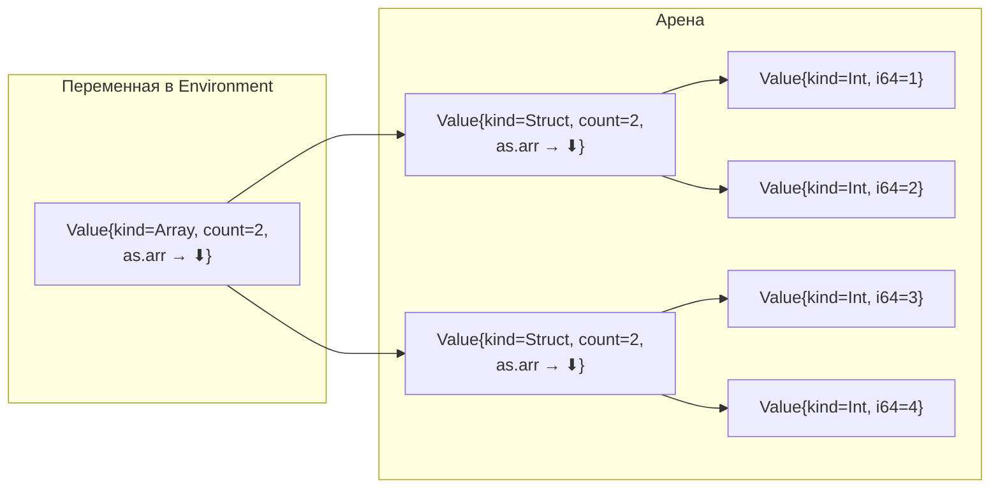

Пример выше — `Точка[2] arr = [Точка{1,2}, Точка{3,4}];`: внешний `Value` (массив, `count=2`) указывает на два соседних `Value`-слота, каждый из которых сам — структура (`count=2`), указывающая на свои поля. Рекурсивность представления — причина, по которой ни `values_equal`, ни индексация, ни передача параметров не требуют отдельного кода для "массива структур" или "структуры с полем-массивом": каждый уровень обрабатывается одинаково, потому что каждый элемент — снова полноценный `Value`.

### 7.1 Проверка границ индекса

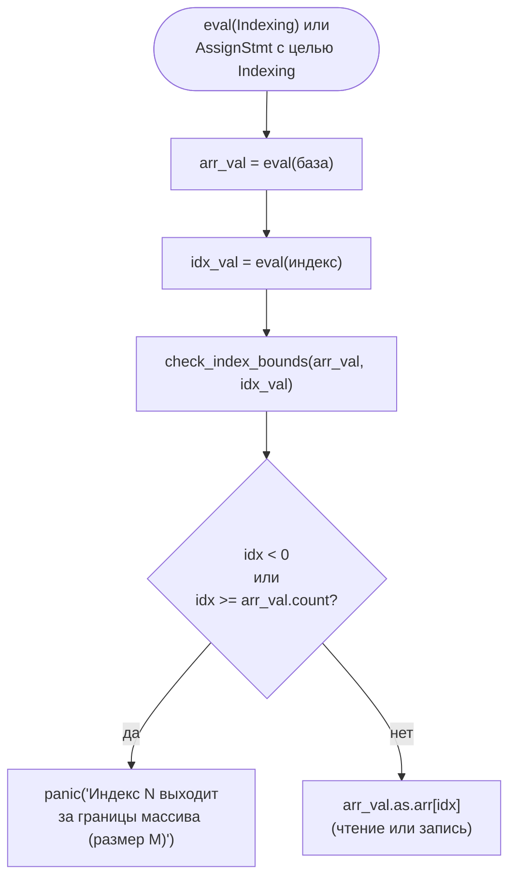

### 7.2 Глубокое сравнение `==`/`!=`

`values_equal(a, b)` — рекурсивная функция, ветвящаяся по `a.kind` (статический анализ уже гарантировал `a.kind == b.kind`):

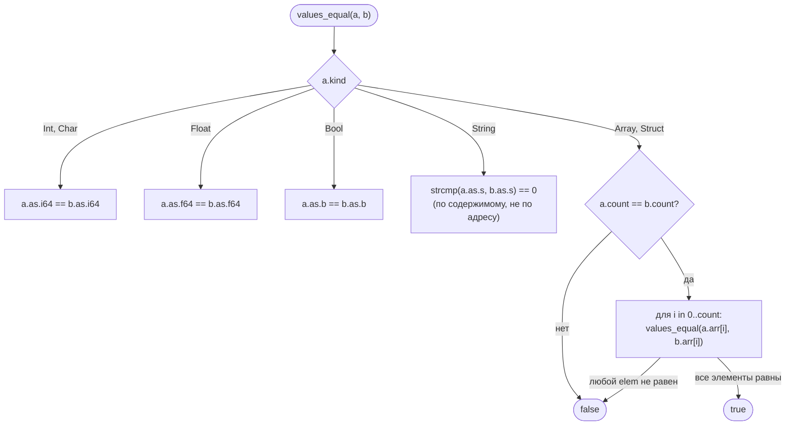

Рекурсия в ветке `Array/Struct` — та же самая функция `values_equal`, поэтому сравнение массива структур или структуры с полем-массивом работает "само собой", без специального случая: на каждом уровне вложенности снова происходит диспетчеризация по `kind` конкретного элемента.

---

## 8. Обработка ошибок: `panic`

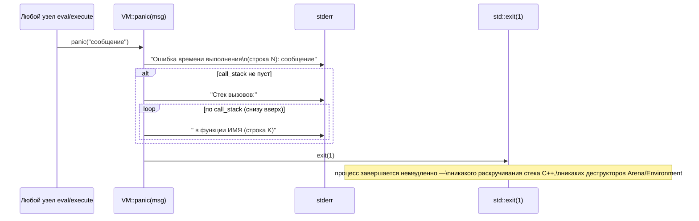

`update_line(id)` вызывается в начале и `eval`, и `execute` для каждого узла — она обновляет `current_line` и (если есть активный вызов) `call_stack.back().call_line`, поэтому в момент паники и заголовок сообщения, и каждый кадр стека вызовов показывают корректную строку, на которой реально остановилось выполнение именно в этом кадре.

---

## 9. Сводная карта взаимодействия компонентов

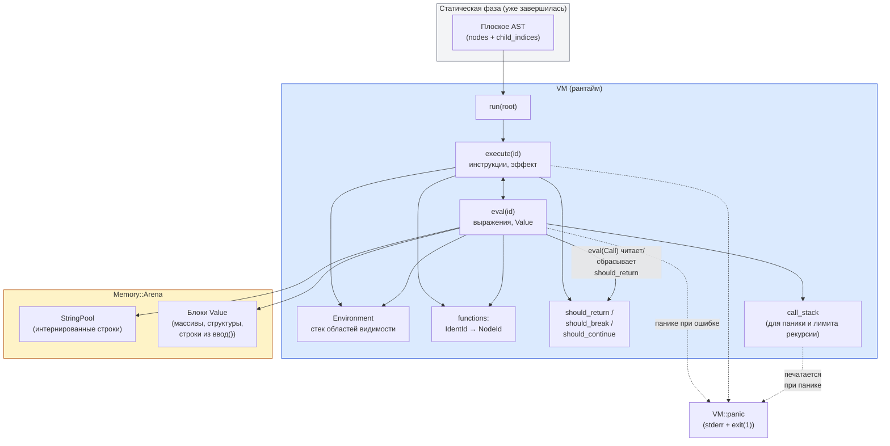

**Итог одним предложением:** `VM` — это интерпретатор с обходом дерева (tree-walking), без байткода и без промежуточного IR; каждый узел AST выполняется/вычисляется напрямую по своему `NodeType`, состояние программы целиком живёт в трёх местах — `Environment` (переменные), Арена (данные массивов/структур/строк) и три флага управления потоком (`should_*`), — а корректность (типы, арность, наличие точки входа) полностью делегирована предыдущей фазе (`Semantic::Analyzer`) и в рантайме не перепроверяется, кроме того, что физически не может быть проверено статически: границы индекса массива, деление на ноль и глубина рекурсии.
